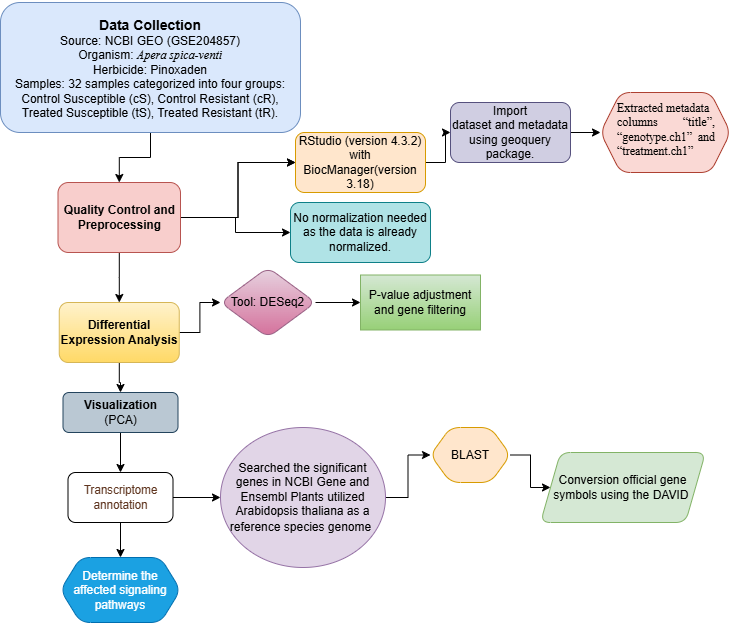

# Transcriptomic Analysis of Pinoxaden Resistance in *Apera spica-venti*

RNA-seq transcriptomic analysis investigating gene-expression changes associated with the development of pinoxaden resistance in *Apera spica-venti*.

## Overview

This repository contains the R-based transcriptomic analysis workflow used to investigate differential gene expression associated with herbicide resistance in *Apera spica-venti*.

The analysis compares transcriptomic profiles between herbicide-resistant and susceptible plants under control and herbicide-treated conditions. The workflow includes differential expression analysis, identification of significantly differentially expressed genes (DEGs), comparison of expression patterns between experimental conditions, gene-level analysis, and visualization of transcriptomic patterns.

The project was developed to investigate molecular responses associated with herbicide resistance and to identify genes and expression patterns that may contribute to the resistant phenotype.

---

## Project Objectives

The main objectives of this project were to:

- Analyze transcriptomic data from resistant and susceptible plant populations.
- Compare gene expression between resistant and susceptible conditions.
- Identify significantly differentially expressed genes (DEGs).
- Apply statistical and fold-change based filtering to prioritize biologically relevant genes.
- Compare DEG sets between experimental conditions.
- Identify common and condition-specific genes.
- Characterize genes using gene identifiers and functional annotation resources.
- Visualize global transcriptomic patterns using PCA, Venn diagrams, and other graphical analyses.
- Generate gene-level datasets for downstream biological interpretation.

---
## Analysis Workflow

The overall transcriptomic analysis workflow is summarized below.



The computational workflow consisted of the following major stages:

1. Transcriptomic data preparation and preprocessing
2. Quality assessment and exploratory analysis
3. Differential expression analysis
4. Statistical and fold-change filtering of DEGs
5. Comparison of DEG sets between experimental conditions
6. Identification of common and condition-specific genes
7. Gene identifier and gene-symbol analysis
8. Functional/gene annotation
9. Visualization of transcriptomic patterns
10. Generation of final gene-level datasets for biological interpretation
## Dataset

The primary expression dataset used in this analysis was obtained from the NCBI Gene Expression Omnibus (GEO), accession **GSE204857**.

The dataset contains transcriptomic data from susceptible and resistant *Apera spica-venti* populations under control and pinoxaden-treated conditions.

---

## Differential Expression Analysis

Differential expression analysis was performed using an R-based workflow.

Multiple experimental comparisons were analyzed to investigate transcriptional differences between resistant and susceptible plants under control and herbicide-treated conditions.

Genes were considered significantly differentially expressed based on:

- Adjusted *p*-value < 0.05
- Absolute log2 fold change ≥ 1

These criteria were used to focus the analysis on genes showing statistically significant and biologically relevant changes in expression.

---
## Results

### Differentially Expressed Genes

Differential expression analysis was performed across the control and pinoxaden-treated groups using DESeq2. Statistical significance was defined using an adjusted *p*-value < 0.05 and an absolute log2 fold change ≥ 1.

Across the transcriptomic dataset containing 39,590 genes, the overall comparison between treated and control groups identified 1,868 upregulated genes and 1,456 downregulated genes.

The major experimental comparisons produced the following DEG profiles:

| Comparison | Upregulated | Downregulated |
|------------|------------:|--------------:|
| Control Susceptible vs Treated Susceptible | 771 | 513 |
| Control Resistant vs Treated Resistant | 430 | 349 |
| Control Resistant vs Control Susceptible | 404 | 418 |
| Treated Resistant vs Treated Susceptible | 462 | 326 |

These comparisons were used to investigate transcriptional responses to pinoxaden treatment and differences associated with the resistant phenotype.

### Principal Component Analysis

Principal component analysis (PCA) was used to visualize the overall expression patterns and relationships among the samples.

The first principal component (PC1) explained 90.55% of the total variance, while the second principal component (PC2) explained 5.12%. The PCA visualization provides an overview of sample-level transcriptional variation across the experimental groups.

###Common Differentially Expressed Genes

To identify genes potentially associated with herbicide resistance, DEG sets from the resistant-versus-susceptible comparisons under control and pinoxaden-treated conditions were compared.

The comparison identified 100 common significant genes shared between the two conditions. These genes were subsequently examined as potential candidates associated with resistance-related transcriptional responses.

###Candidate Resistance-Associated Genes

Further analysis of the common DEG set identified 32 genes potentially associated with pinoxaden resistance in Apera spica-venti.

Among these candidates, 22 genes were successfully annotated using sequence similarity and comparative annotation approaches. The annotated candidates included proteins belonging to families such as leucine-rich repeat (LRR) proteins, protein kinases, F-box proteins, calcineurin B-like proteins, receptor-like protein kinases, zinc-finger proteins, and chaperone-related proteins.

Additional candidate genes included cysteine proteinase RD21A, jasmonate-induced proteins, retrotransposon-related proteins, sphingosine kinase 2, FAR1-related sequences, early nodulin-like protein 3, and short-chain dehydrogenase/reductase 2b.

###Gene-Level Analysis

The common-gene analysis was further used to organize gene identifiers, gene symbols, expression values, and annotation information for downstream biological interpretation.

I **would not put the entire 100-gene table or all 32/22 gene names directly into the README**. Your current structure is better:

```text
results/
├── DEG_tables/
├── Filter_result/
├── figures/
└── genes/
``` 
